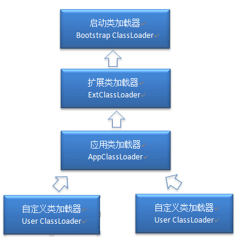

# JVM

## JVN内存结构


方法区和对是所有线程共享的内存区域；而java栈、本地方法栈和程序员计数器是运行是线程私有的内存区域。

- Java堆（Heap）,是Java虚拟机所管理的内存中最大的一块。Java堆是被所有线程共享的一块内存区域，在虚拟机启动时创建。此内存区域的唯一目的就是存放对象实例，几乎所有的对象实例都在这里分配内存。

- 方法区（Method Area）,方法区（Method Area）与Java堆一样，是各个线程共享的内存区域，它用于存储已被虚拟机加载的类信息、常量、静态变量、即时编译器编译后的代码等数据。

- 程序计数器（Program Counter Register）,程序计数器（Program Counter Register）是一块较小的内存空间，它的作用可以看做是当前线程所执行的字节码的行号指示器。

- JVM栈（JVM Stacks）,与程序计数器一样，Java虚拟机栈（Java Virtual Machine Stacks）也是线程私有的，它的生命周期与线程相同。虚拟机栈描述的是Java方法执行的内存模型：每个方法被执行的时候都会同时创建一个栈帧（Stack Frame）用于存储局部变量表、操作栈、动态链接、方法出口等信息。每一个方法被调用直至执行完成的过程，就对应着一个栈帧在虚拟机栈中从入栈到出栈的过程。

- 本地方法栈（Native Method Stacks）,本地方法栈（Native Method Stacks）与虚拟机栈所发挥的作用是非常相似的，其区别不过是虚拟机栈为虚拟机执行Java方法（也就是字节码）服务，而本地方法栈则是为虚拟机使用到的Native方法服务。

## 对象分配规则

- 对象优先分配在Eden区，如果Eden区没有足够的空间时，虚拟机执行一次Minor GC。

- 大对象直接进入老年代（大对象是指需要大量连续内存空间的对象）。这样做的目的是避免在Eden区和两个Survivor区之间发生大量的内存拷贝（新生代采用复制算法收集内存）。

- 长期存活的对象进入老年代。虚拟机为每个对象定义了一个年龄计数器，如果对象经过了1次Minor GC那么对象会进入Survivor区，之后每经过一次Minor GC那么对象的年龄加1，知道达到阀值对象进入老年区。

- 动态判断对象的年龄。如果Survivor区中相同年龄的所有对象大小的总和大于Survivor空间的一半，年龄大于或等于该年龄的对象可以直接进入老年代。

- 空间分配担保。每次进行Minor GC时，JVM会计算Survivor区移至老年区的对象的平均大小，如果这个值大于老年区的剩余值大小则进行一次Full GC，如果小于检查HandlePromotionFailure设置，如果true则只进行Monitor GC,如果false则进行Full GC。

## 解释内存中的栈(stack)、堆(heap)和静态区(static area)的用法

通常我们定义一个基本数据类型的变量，一个对象的引用，还有就是函数调用的现场保存都使用内存中的栈空间；而通过new关键字和构造器创建的对象放在堆空间；程序中的字面量（literal）如直接书写的100、”hello”和常量都是放在静态区中。栈空间操作起来最快但是栈很小，通常大量的对象都是放在堆空间，理论上整个内存没有被其他进程使用的空间甚至硬盘上的虚拟内存都可以被当成堆空间来使用。

    String str = new String("hello");

上面的语句中变量str放在栈上，用new创建出来的字符串对象放在堆上，而”hello”这个字面量放在静态区。

## 什么是类的加载

类的加载指的是将类的.class文件中的二进制数据读入到内存中，将其放在运行时数据区的方法区内，然后在堆区创建一个java.lang.Class对象，用来封装类在方法区内的数据结构。类的加载的最终产品是位于堆区中的Class对象，Class对象封装了类在方法区内的数据结构，并且向Java程序员提供了访问方法区内的数据结构的接口。

类加载器



- 启动类加载器：Bootstrap ClassLoader，负责加载存放在JDK\jre\lib(JDK代表JDK的安装目录，下同)下，或被-Xbootclasspath参数指定的路径中的，并且能被虚拟机识别的类库
- 扩展类加载器：Extension ClassLoader，该加载器由sun.misc.Launcher$ExtClassLoader实现，它负责加载DK\jre\lib\ext目录中，或者由java.ext.dirs系统变量指定的路径中的所有类库（如javax.*开头的类），开发者可以直接使用扩展类加载器。
- 应用程序类加载器：Application ClassLoader，该类加载器由sun.misc.Launcher$AppClassLoader来实现，它负责加载用户类路径（ClassPath）所指定的类，开发者可以直接使用该类加载器

## 描述一下JVM加载class文件的原理机制？

JVM中类的装载是由类加载器（ClassLoader）和它的子类来实现的，Java中的类加载器是一个重要的Java运行时系统组件，它负责在运行时查找和装入类文件中的类。

由于Java的跨平台性，经过编译的Java源程序并不是一个可执行程序，而是一个或多个类文件。当Java程序需要使用某个类时，JVM会确保这个类已经被加载、连接（验证、准备和解析）和初始化。

类的加载是指把类的.class文件中的数据读入到内存中，通常是创建一个字节数组读入.class文件，然后产生与所加载类对应的Class对象。加载完成后，Class对象还不完整，所以此时的类还不可用。当类被加载后就进入连接阶段，这一阶段包括验证、准备（为静态变量分配内存并设置默认的初始值）和解析（将符号引用替换为直接引用）三个步骤。最后JVM对类进行初始化，包括：1)如果类存在直接的父类并且这个类还没有被初始化，那么就先初始化父类；2)如果类中存在初始化语句，就依次执行这些初始化语句。类的加载是由类加载器完成的，类加载器包括：根加载器（BootStrap）、扩展加载器（Extension）、系统加载器（System）和用户自定义类加载器（java.lang.ClassLoader的子类）。从Java 2（JDK 1.2）开始，类加载过程采取了父亲委托机制（PDM）。PDM更好的保证了Java平台的安全性，在该机制中，JVM自带的Bootstrap是根加载器，其他的加载器都有且仅有一个父类加载器。类的加载首先请求父类加载器加载，父类加载器无能为力时才由其子类加载器自行加载。JVM不会向Java程序提供对Bootstrap的引用。

下面是关于几个类加载器的说明：

- ootstrap：一般用本地代码实现，负责加载JVM基础核心类库（rt.jar）；
- Extension：从java.ext.dirs系统属性所指定的目录中加载类库，它的父加载器是Bootstrap；
- System：又叫应用类加载器，其父类是Extension。它是应用最广泛的类加载器。它从环境变量classpath或者系统属性java.class.path所指定的目录中记载类，是用户自定义加载器的默认父加载器。

## Java对象创建过程

1. JVM遇到一条新建对象的指令时首先去检查这个指令的参数是否能在常量池中定义到一个类的符号引用。然后加载这个类（类加载过程在后边讲）
1. 为对象分配内存。一种办法“指针碰撞”、一种办法“空闲列表”，最终常用的办法“本地线程缓冲分配(TLAB)”
1. 将除对象头外的对象内存空间初始化为0
1. 对对象头进行必要设置

## 类的生命周期

类的生命周期包括这几个部分，加载、连接、初始化、使用和卸载，其中前三部是类的加载的过程,如下图:


- 加载，查找并加载类的二进制数据，在Java堆中也创建一个java.lang.Class类的对象
- 连接，连接又包含三块内容：验证、准备、初始化。 1）验证，文件格式、元数据、字节码、符号引用验证； 2）准备，为类的静态变量分配内存，并将其初始化为默认值； 3）解析，把类中的符号引用转换为直接引用
- 初始化，为类的静态变量赋予正确的初始值
- 使用，new出对象程序中使用
- 卸载，执行垃圾回收

## Java 中会存在内存泄漏吗，请简单描述。

理论上Java因为有垃圾回收机制（GC）不会存在内存泄露问题（这也是Java被广泛使用于服务器端编程的一个重要原因）；然而在实际开发中，可能会存在无用但可达的对象，这些对象不能被GC回收，因此也会导致内存泄露的发生。例如hibernate的Session（一级缓存）中的对象属于持久态，垃圾回收器是不会回收这些对象的，然而这些对象中可能存在无用的垃圾对象，如果不及时关闭（close）或清空（flush）一级缓存就可能导致内存泄露。下面例子中的代码也会导致内存泄露。

```java
import java.util.Arrays;
import java.util.EmptyStackException;

public class MyStack<T> {
    private T[] elements;
    private int size = 0;

    private static final int INIT_CAPACITY = 16;

    public MyStack() {
        elements = (T[]) new Object[INIT_CAPACITY];
    }

    public void push(T elem) {
        ensureCapacity();
        elements[size++] = elem;
    }

    public T pop() {
        if(size == 0)
            throw new EmptyStackException();
        return elements[--size];
    }

    private void ensureCapacity() {
        if(elements.length == size) {
            elements = Arrays.copyOf(elements, 2 * size + 1);
        }
    }
}
```

上面的代码实现了一个栈（先进后出（FILO））结构，乍看之下似乎没有什么明显的问题，它甚至可以通过你编写的各种单元测试。
然而其中的pop方法却存在内存泄露的问题，当我们用pop方法弹出栈中的对象时，该对象不会被当作垃圾回收，即使使用栈的程序不再引用这些对象，因为栈内部维护着对这些对象的过期引用（obsolete reference）。在支持垃圾回收的语言中，内存泄露是很隐蔽的，这种内存泄露其实就是无意识的对象保持。
如果一个对象引用被无意识的保留起来了，那么垃圾回收器不会处理这个对象，也不会处理该对象引用的其他对象，即使这样的对象只有少数几个，也可能会导致很多的对象被排除在垃圾回收之外，从而对性能造成重大影响，极端情况下会引发Disk Paging（物理内存与硬盘的虚拟内存交换数据），甚至造成OutOfMemoryError。

## GC是什么？为什么要有GC？

GC是垃圾收集的意思，内存处理是编程人员容易出现问题的地方，忘记或者错误的内存回收会导致程序或系统的不稳定甚至崩溃，Java提供的GC功能可以自动监测对象是否超过作用域从而达到自动回收内存的目的，Java语言没有提供释放已分配内存的显示操作方法。
Java程序员不用担心内存管理，因为垃圾收集器会自动进行管理。要请求垃圾收集，可以调用下面的方法之一：System.gc() 或Runtime.getRuntime().gc() ，但JVM可以屏蔽掉显示的垃圾回收调用。
垃圾回收可以有效的防止内存泄露，有效的使用可以使用的内存。垃圾回收器通常是作为一个单独的低优先级的线程运行，不可预知的情况下对内存堆中已经死亡的或者长时间没有使用的对象进行清除和回收，程序员不能实时的调用垃圾回收器对某个对象或所有对象进行垃圾回收。
在Java诞生初期，垃圾回收是Java最大的亮点之一，因为服务器端的编程需要有效的防止内存泄露问题，然而时过境迁，如今Java的垃圾回收机制已经成为被诟病的东西。移动智能终端用户通常觉得iOS的系统比Android系统有更好的用户体验，其中一个深层次的原因就在于Android系统中垃圾回收的不可预知性。

补充：垃圾回收机制有很多种，包括：分代复制垃圾回收、标记垃圾回收、增量垃圾回收等方式。标准的Java进程既有栈又有堆。栈保存了原始型局部变量，堆保存了要创建的对象。Java平台对堆内存回收和再利用的基本算法被称为标记和清除，但是Java对其进行了改进，采用“分代式垃圾收集”。这种方法会跟Java对象的生命周期将堆内存划分为不同的区域，在垃圾收集过程中，可能会将对象移动到不同区域：

- 伊甸园（Eden）：这是对象最初诞生的区域，并且对大多数对象来说，这里是它们唯一存在过的区域。
- 幸存者乐园（Survivor）：从伊甸园幸存下来的对象会被挪到这里。
- 终身颐养园（Tenured）：这是足够老的幸存对象的归宿。年轻代收集（Minor-GC）过程是不会触及这个地方的。当年轻代收集不能把对象放进终身颐养园时，就会触发一次完全收集（Major-GC），这里可能还会牵扯到压缩，以便为大对象腾出足够的空间。

与垃圾回收相关的JVM参数：

- -Xms / -Xmx — 堆的初始大小 / 堆的最大大小
- -Xmn — 堆中年轻代的大小
- -XX:-DisableExplicitGC — 让System.gc()不产生任何作用
- -XX:+PrintGCDetails — 打印GC的细节
- -XX:+PrintGCDateStamps — 打印GC操作的时间戳
- -XX:NewSize / XX:MaxNewSize — 设置新生代大小/新生代最大大小
- -XX:NewRatio — 可以设置老生代和新生代的比例
- -XX:PrintTenuringDistribution — 设置每次新生代GC后输出幸存者乐园中对象年龄的分布
- -XX:InitialTenuringThreshold / -XX:MaxTenuringThreshold：设置老年代阀值的初始值和最大值
- -XX:TargetSurvivorRatio：设置幸存区的目标使用率

## 你知道哪些垃圾回收算法？

GC最基础的算法有三种： 标记 -清除算法、复制算法、标记-压缩算法，我们常用的垃圾回收器一般都采用分代收集算法。

- 标记-清除算法，“标记-清除”（Mark-Sweep）算法，如它的名字一样，算法分为“标记”和“清除”两个阶段：首先标记出所有需要回收的对象，在标记完成后统一回收掉所有被标记的对象。
- 复制算法，“复制”（Copying）的收集算法，它将可用内存按容量划分为大小相等的两块，每次只使用其中的一块。当这一块的内存用完了，就将还存活着的对象复制到另外一块上面，然后再把已使用过的内存空间一次清理掉。
- 标记-压缩算法，标记过程仍然与“标记-清除”算法一样，但后续步骤不是直接对可回收对象进行清理，而是让所有存活的对象都向一端移动，然后直接清理掉端边界以外的内存
- 分代收集算法，“分代收集”（Generational Collection）算法，把Java堆分为新生代和老年代，这样就可以根据各个年代的特点采用最适当的收集算法。

更详细的内容参见深入理解垃圾回收算法：http://blog.csdn.net/dd864140130/article/details/50084471

## 垃圾回收器

- Serial收集器，串行收集器是最古老，最稳定以及效率高的收集器，可能会产生较长的停顿，只使用一个线程去回收。
- ParNew收集器，ParNew收集器其实就是Serial收集器的多线程版本。
- Parallel收集器，Parallel Scavenge收集器类似ParNew收集器，Parallel收集器更关注系统的吞吐量。
- Parallel Old 收集器，Parallel Old是Parallel Scavenge收集器的老年代版本，使用多线程和“标记－整理”算法
- CMS收集器，CMS（Concurrent Mark Sweep）收集器是一种以获取最短回收停顿时间为目标的收集器。
- G1收集器，G1 (Garbage-First)是一款面向服务器的垃圾收集器,主要针对配备多颗处理器及大容量内存的机器. 以极高概率满足GC停顿时间要求的同时,还具备高吞吐量性能特征

## 如何判断一个对象是否应该被回收

判断对象是否存活一般有两种方式：

- 引用计数：每个对象有一个引用计数属性，新增一个引用时计数加1，引用释放时计数减1，计数为0时可以回收。此方法简单，无法解决对象相互循环引用的问题。
- 可达性分析（Reachability Analysis）：从GC Roots开始向下搜索，搜索所走过的路径称为引用链。当一个对象到GC Roots没有任何引用链相连时，则证明此对象是不可用的，不可达对象。

## JVM的永久代中会发生垃圾回收么？

垃圾回收不会发生在永久代，如果永久代满了或者是超过了临界值，会触发完全垃圾回收(Full GC)。如果你仔细查看垃圾收集器的输出信息，就会发现永久代也是被回收的。这就是为什么正确的永久代大小对避免Full GC是非常重要的原因。请参考下Java8：从永久代到元数据区 (注：Java8中已经移除了永久代，新加了一个叫做元数据区的native内存区)

## 引用的分类

- 强引用：GC时不会被回收
- 软引用：描述有用但不是必须的对象，在发生内存溢出异常之前被回收
- 弱引用：描述有用但不是必须的对象，在下一次GC时被回收
- 虚引用（幽灵引用/幻影引用）:无法通过虚引用获得对象，用PhantomReference实现虚引用，虚引用用来在GC时返回一个通知。

## 调优命令

Sun JDK监控和故障处理命令有jps jstat jmap jhat jstack jinfo

- jps，JVM Process Status Tool,显示指定系统内所有的HotSpot虚拟机进程。
- jstat，JVM statistics Monitoring是用于监视虚拟机运行时状态信息的命令，它可以显示出虚拟机进程中的类装载、内存、垃圾收集、JIT编译等运行数据。
- jmap，JVM Memory Map命令用于生成heap dump文件
- jhat，JVM Heap Analysis Tool命令是与jmap搭配使用，用来分析jmap生成的dump，jhat内置了一个微型的HTTP/HTML服务器，生成dump的分析结果后，可以在浏览器中查看
- jstack，用于生成java虚拟机当前时刻的线程快照。
- jinfo，JVM Configuration info 这个命令作用是实时查看和调整虚拟机运行参数。

## 调优工具

常用调优工具分为两类,jdk自带监控工具：jconsole和jvisualvm，第三方有：MAT(Memory Analyzer Tool)、GChisto。

- jconsole，Java Monitoring and Management Console是从java5开始，在JDK中自带的java监控和管理控制台，用于对JVM中内存，线程和类等的监控
- jvisualvm，jdk自带全能工具，可以分析内存快照、线程快照；监控内存变化、GC变化等。
- MAT，Memory Analyzer Tool，一个基于Eclipse的内存分析工具，是一个快速、功能丰富的Java heap分析工具，它可以帮助我们查找内存泄漏和减少内存消耗
- GChisto，一款专业分析gc日志的工具

## Minor GC与Full GC分别在什么时候发生？

新生代内存不够用时候发生MGC也叫YGC，JVM内存不够的时候发生FGC