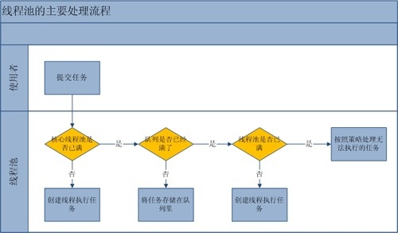

# 多线程

## 什么是进程，什么是线程，为什么需要多线程编程？

进程是具有一定独立功能的程序关于某个数据集合上的一次运行活动，是操作系统进行资源分配和调度的一个独立单位；

线程是进程的一个实体，是CPU调度和分派的基本单位，是比进程更小的能独立运行的基本单位。线程的划分尺度小于进程，这使得多线程程序的并发性高；进程在执行时通常拥有独立的内存单元，而线程之间可以共享内存。

使用多线程的编程通常能够带来更好的性能和用户体验，但是多线程的程序对于其他程序是不友好的，因为它可能占用了更多的CPU资源。当然，也不是线程越多，程序的性能就越好，因为线程之间的调度和切换也会浪费CPU时间。时下很时髦的Node.js就采用了单线程异步I/O的工作模式。

## 什么是线程安全

如果你的代码在多线程下执行和在单线程下执行永远都能获得一样的结果，那么你的代码就是线程安全的。

这个问题有值得一提的地方，就是线程安全也是有几个级别的：

- 不可变。像String、Integer、Long这些，都是final类型的类，任何一个线程都改变不了它们的值，要改变除非新创建一个，因此这些不可变对象不需要任何同步手段就可以直接在多线程环境下使用
- 绝对线程安全。不管运行时环境如何，调用者都不需要额外的同步措施。要做到这一点通常需要付出许多额外的代价，Java中标注自己是线程安全的类，实际上绝大多数都不是线程安全的，不过绝对线程安全的类，Java中也有，比方说CopyOnWriteArrayList、CopyOnWriteArraySet
- 相对线程安全。相对线程安全也就是我们通常意义上所说的线程安全，像Vector这种，add、remove方法都是原子操作，不会被打断，但也仅限于此，如果有个线程在遍历某个Vector、有个线程同时在add这个Vector，99%的情况下都会出现ConcurrentModificationException，也就是fail-fast机制。
- 线程非安全。这个就没什么好说的了，ArrayList、LinkedList、HashMap等都是线程非安全的类

## 编写多线程程序有几种实现方式？

Java 5以前实现多线程有两种实现方法：一种是继承Thread类；另一种是实现Runnable接口。
两种方式都要通过重写run()方法来定义线程的行为，推荐使用后者，因为Java中的继承是单继承，一个类有一个父类，如果继承了Thread类就无法再继承其他类了，显然使用Runnable接口更为灵活。

Java 5以后创建线程还有第三种方式：实现Callable接口，该接口中的call方法可以在线程执行结束时产生一个返回值。

## synchronized关键字的用法？

synchronized关键字可以将对象或者方法标记为同步，以实现对对象和方法的互斥访问，可以用synchronized(对象) { … }定义同步代码块，或者在声明方法时将synchronized作为方法的修饰符。

## 简述synchronized 和java.util.concurrent.locks.Lock的异同？

Lock是Java 5以后引入的新的API，和关键字synchronized相比主要相同点：Lock 能完成synchronized所实现的所有功能；主要不同点：Lock有比synchronized更精确的线程语义和更好的性能，而且不强制性的要求一定要获得锁。synchronized会自动释放锁，而Lock一定要求程序员手工释放，并且最好在finally 块中释放（这是释放外部资源的最好的地方）。

## 当一个线程进入一个对象的synchronized方法A之后，其它线程是否可进入此对象的synchronized方法B？

不能。其它线程只能访问该对象的非同步方法，同步方法则不能进入。因为非静态方法上的synchronized修饰符要求执行方法时要获得对象的锁，如果已经进入A方法说明对象锁已经被取走，那么试图进入B方法的线程就只能在等锁池（注意不是等待池哦）中等待对象的锁。

## synchronized和ReentrantLock的区别

synchronized是和if、else、for、while一样的关键字，ReentrantLock是类，这是二者的本质区别。既然ReentrantLock是类，那么它就提供了比synchronized更多更灵活的特性，可以被继承、可以有方法、可以有各种各样的类变量，ReentrantLock比synchronized的扩展性体现在几点上：

1. ReentrantLock可以对获取锁的等待时间进行设置，这样就避免了死锁
1. ReentrantLock可以获取各种锁的信息
1. ReentrantLock可以灵活地实现多路通知

另外，二者的锁机制其实也是不一样的:ReentrantLock底层调用的是Unsafe的park方法加锁，synchronized操作的应该是对象头中mark word.

## 举例说明同步和异步。

如果系统中存在临界资源（资源数量少于竞争资源的线程数量的资源），例如正在写的数据以后可能被另一个线程读到，或者正在读的数据可能已经被另一个线程写过了，那么这些数据就必须进行同步存取（数据库操作中的排他锁就是最好的例子）。当应用程序在对象上调用了一个需要花费很长时间来执行的方法，并且不希望让程序等待方法的返回时，就应该使用异步编程，在很多情况下采用异步途径往往更有效率。事实上，所谓的同步就是指阻塞式操作，而异步就是非阻塞式操作。

## 启动一个线程是调用run()还是start()方法？

启动一个线程是调用start()方法，使线程所代表的虚拟处理机处于可运行状态，这意味着它可以由JVM 调度并执行，这并不意味着线程就会立即运行。run()方法是线程启动后要进行回调（callback）的方法。

## 为什么需要run()和start()方法，我们可以只用run()方法来完成任务吗？

我们需要run()&start()这两个方法是因为JVM创建一个单独的线程不同于普通方法的调用，所以这项工作由线程的start方法来完成，start由本地方法实现，需要显示地被调用，使用这俩个方法的另外一个好处是任何一个对象都可以作为线程运行，只要实现了Runnable接口，这就避免因继承了Thread类而造成的Java的多继承问题。

## 什么是线程池（thread pool）？

在面向对象编程中，创建和销毁对象是很费时间的，因为创建一个对象要获取内存资源或者其它更多资源。

在Java中更是如此，虚拟机将试图跟踪每一个对象，以便能够在对象销毁后进行垃圾回收。所以提高服务程序效率的一个手段就是尽可能减少创建和销毁对象的次数，特别是一些很耗资源的对象创建和销毁，这就是“池化资源”技术产生的原因。线程池顾名思义就是事先创建若干个可执行的线程放入一个池（容器）中，需要的时候从池中获取线程不用自行创建，使用完毕不需要销毁线程而是放回池中，从而减少创建和销毁线程对象的开销。

Java 5+中的Executor接口定义一个执行线程的工具。它的子类型即线程池接口是ExecutorService。要配置一个线程池是比较复杂的，尤其是对于线程池的原理不是很清楚的情况下，因此在工具类Executors面提供了一些静态工厂方法，生成一些常用的线程池，如下所示：

- newSingleThreadExecutor：创建一个单线程的线程池。这个线程池只有一个线程在工作，也就是相当于单线程串行执行所有任务。如果这个唯一的线程因为异常结束，那么会有一个新的线程来替代它。此线程池保证所有任务的执行顺序按照任务的提交顺序执行。
- newFixedThreadPool：创建固定大小的线程池。每次提交一个任务就创建一个线程，直到线程达到线程池的最大大小。线程池的大小一旦达到最大值就会保持不变，如果某个线程因为执行异常而结束，那么线程池会补充一个新线程。
- newCachedThreadPool：创建一个可缓存的线程池。如果线程池的大小超过了处理任务所需要的线程，那么就会回收部分空闲（60秒不执行任务）的线程，当任务数增加时，此线程池又可以智能的添加新线程来处理任务。此线程池不会对线程池大小做限制，线程池大小完全依赖于操作系统（或者说JVM）能够创建的最大线程大小。
- newScheduledThreadPool：创建一个大小无限的线程池。此线程池支持定时以及周期性执行任务的需求。
- newSingleThreadExecutor：创建一个单线程的线程池。此线程池支持定时以及周期性执行任务的需求。

## 线程的基本状态以及状态之间的关系？


其中Running表示运行状态；Runnable表示就绪状态（万事俱备，只欠CPU）；Blocked表示阻塞状态；阻塞状态又有多种情况，可能是因为调用wait()方法进入等待池，也可能是执行同步方法或同步代码块进入等锁池，或者是调用了sleep()方法或join()方法等待休眠或其他线程结束，或是因为发生了I/O中断。

## Java中如何实现序列化，有什么意义？

序列化就是一种用来处理对象流的机制，所谓对象流也就是将对象的内容进行流化。可以对流化后的对象进行读写操作，也可将流化后的对象传输于网络之间。序列化是为了解决对象流读写操作时可能引发的问题（如果不进行序列化可能会存在数据乱序的问题）。

要实现序列化，需要让一个类实现Serializable接口，该接口是一个标识性接口，标注该类对象是可被序列化的，然后使用一个输出流来构造一个对象输出流并通过writeObject(Object)方法就可以将实现对象写出（即保存其状态）；如果需要反序列化则可以用一个输入流建立对象输入流，然后通过readObject方法从流中读取对象。序列化除了能够实现对象的持久化之外，还能够用于对象的深度克隆。

## 产生死锁的条件

1. 互斥条件：一个资源每次只能被一个进程使用。
2. 请求与保持条件：一个进程因请求资源而阻塞时，对已获得的资源保持不放
3. 不剥夺条件:进程已获得的资源，在末使用完之前，不能强行剥夺。
4. 循环等待条件:若干进程之间形成一种头尾相接的循环等待资源关系。

## 什么是线程饿死，什么是活锁？

线程饿死和活锁虽然不想是死锁一样的常见问题，但是对于并发编程的设计者来说就像一次邂逅一样。

当所有线程阻塞，或者由于需要的资源无效而不能处理，不存在非阻塞线程使资源可用。JavaAPI中线程活锁可能发生在以下情形：

- 当所有线程在程序中执行Object.wait(0)，参数为0的wait方法。程序将发生活锁直到在相应的对象上有线程调用Object.notify()或者Object.notifyAll()。
- 当所有线程卡在无限循环中。

## 什么导致线程阻塞

阻塞指的是暂停一个线程的执行以等待某个条件发生（如某资源就绪），学过操作系统的同学对它一定已经很熟悉了。Java 提供了大量方法来支持阻塞，下面让我们逐一分析。

| 方法 | 说明 |
|--|--|
| sleep() |sleep() 允许 指定以毫秒为单位的一段时间作为参数，它使得线程在指定的时间内进入阻塞状态，不能得到CPU 时间，指定的时间一过，线程重新进入可执行状态。 典型地，sleep() 被用在等待某个资源就绪的情形：测试发现条件不满足后，让线程阻塞一段时间后重新测试，直到条件满足为止 |
| suspend() 和 resume()| 两个方法配套使用，suspend()使得线程进入阻塞状态，并且不会自动恢复，必须其对应的resume() 被调用，才能使得线程重新进入可执行状态。典型地，suspend() 和 resume() 被用在等待另一个线程产生的结果的情形：测试发现结果还没有产生后，让线程阻塞，另一个线程产生了结果后，调用 resume() 使其恢复。|
| yield() | yield() 使当前线程放弃当前已经分得的CPU 时间，但不使当前线程阻塞，即线程仍处于可执行状态，随时可能再次分得 CPU 时间。调用 yield() 的效果等价于调度程序认为该线程已执行了足够的时间从而转到另一个线程。|
| wait() 和 notify() | 两个方法配套使用，wait() 使得线程进入阻塞状态，它有两种形式，一种允许 指定以毫秒为单位的一段时间作为参数，另一种没有参数，前者当对应的 notify() 被调用或者超出指定时间时线程重新进入可执行状态，后者则必须对应的 notify() 被调用. |

## 怎么检测一个线程是否持有对象监视器

Thread类提供了一个holdsLock(Object obj)方法，当且仅当对象obj的监视器被某条线程持有的时候才会返回true，注意这是一个static方法，这意味着”某条线程”指的是当前线程。

## 请说出与线程同步以及线程调度相关的方法。

- wait()：使一个线程处于等待（阻塞）状态，并且释放所持有的对象的锁；
- sleep()：使一个正在运行的线程处于睡眠状态，是一个静态方法，调用此方法要处理InterruptedException异常；
- notify()：唤醒一个处于等待状态的线程，当然在调用此方法的时候，并不能确切的唤醒某一个等待状态的线程，而是由JVM确定唤醒哪个线程，而且与优先级无关；
- notityAll()：唤醒所有处于等待状态的线程，该方法并不是将对象的锁给所有线程，而是让它们竞争，只有获得锁的线程才能进入就绪状态；

## sleep() 、join（）、yield（）有什么区别

- sleep()方法给其他线程运行机会时不考虑线程的优先级，因此会给低优先级的线程以运行的机会；yield()方法只会给相同优先级或更高优先级的线程以运行的机会；
- 线程执行sleep()方法后转入阻塞（blocked）状态，而执行yield()方法后转入就绪（ready）状态；
- sleep()方法声明抛出InterruptedException，而yield()方法没有声明任何异常；
- sleep()方法比yield()方法（跟操作系统CPU调度相关）具有更好的可移植性。

## wait(),notify()和suspend(),resume()之间的区别

初看起来它们与 suspend() 和 resume() 方法对没有什么分别，但是事实上它们是截然不同的。区别的核心在于，前面叙述的所有方法，阻塞时都不会释放占用的锁（如果占用了的话），而这一对方法则相反。上述的核心区别导致了一系列的细节上的区别。

首先，前面叙述的所有方法都隶属于 Thread 类，但是这一对却直接隶属于 Object 类，也就是说，所有对象都拥有这一对方法。初看起来这十分不可思议，但是实际上却是很自然的，因为这一对方法阻塞时要释放占用的锁，而锁是任何对象都具有的，调用任意对象的 wait() 方法导致线程阻塞，并且该对象上的锁被释放。而调用 任意对象的notify()方法则导致从调用该对象的 wait() 方法而阻塞的线程中随机选择的一个解除阻塞（但要等到获得锁后才真正可执行）。

其次，前面叙述的所有方法都可在任何位置调用，但是这一对方法却必须在 synchronized 方法或块中调用，理由也很简单，只有在synchronized 方法或块中当前线程才占有锁，才有锁可以释放。同样的道理，调用这一对方法的对象上的锁必须为当前线程所拥有，这样才有锁可以释放。因此，这一对方法调用必须放置在这样的 synchronized 方法或块中，该方法或块的上锁对象就是调用这一对方法的对象。若不满足这一条件，则程序虽然仍能编译，但在运行时会出现IllegalMonitorStateException 异常。

wait() 和 notify() 方法的上述特性决定了它们经常和synchronized关键字一起使用，将它们和操作系统进程间通信机制作一个比较就会发现它们的相似性：synchronized方法或块提供了类似于操作系统原语的功能，它们的执行不会受到多线程机制的干扰，而这一对方法则相当于 block 和wakeup 原语（这一对方法均声明为 synchronized）。它们的结合使得我们可以实现操作系统上一系列精妙的进程间通信的算法（如信号量算法），并用于解决各种复杂的线程间通信问题。

关于 wait() 和 notify() 方法最后再说明两点：

第一：调用 notify() 方法导致解除阻塞的线程是从因调用该对象的 wait() 方法而阻塞的线程中随机选取的，我们无法预料哪一个线程将会被选择，所以编程时要特别小心，避免因这种不确定性而产生问题。

第二：除了 notify()，还有一个方法 notifyAll() 也可起到类似作用，唯一的区别在于，调用 notifyAll() 方法将把因调用该对象的 wait() 方法而阻塞的所有线程一次性全部解除阻塞。当然，只有获得锁的那一个线程才能进入可执行状态。

谈到阻塞，就不能不谈一谈死锁，略一分析就能发现，suspend() 方法和不指定超时期限的 wait() 方法的调用都可能产生死锁。遗憾的是，Java 并不在语言级别上支持死锁的避免，我们在编程中必须小心地避免死锁。

以上我们对 Java 中实现线程阻塞的各种方法作了一番分析，我们重点分析了 wait() 和 notify() 方法，因为它们的功能最强大，使用也最灵活，但是这也导致了它们的效率较低，较容易出错。实际使用中我们应该灵活使用各种方法，以便更好地达到我们的目的。

## 为什么wait()方法和notify()/notifyAll()方法要在同步块中被调用

这是JDK强制的，wait()方法和notify()/notifyAll()方法在调用前都必须先获得对象的锁

## wait()方法和notify()/notifyAll()方法在放弃对象监视器时有什么区别

wait()方法和notify()/notifyAll()方法在放弃对象监视器的时候的区别在于：wait()方法立即释放对象监视器，notify()/notifyAll()方法则会等待线程剩余代码执行完毕才会放弃对象监视器。

## Runnable和Callable的区别

Runnable接口中的run()方法的返回值是void，它做的事情只是纯粹地去执行run()方法中的代码而已；Callable接口中的call()方法是有返回值的，是一个泛型，和Future、FutureTask配合可以用来获取异步执行的结果。

这其实是很有用的一个特性，因为多线程相比单线程更难、更复杂的一个重要原因就是因为多线程充满着未知性，某条线程是否执行了？某条线程执行了多久？某条线程执行的时候我们期望的数据是否已经赋值完毕？无法得知，我们能做的只是等待这条多线程的任务执行完毕而已。而Callable+Future/FutureTask却可以方便获取多线程运行的结果，可以在等待时间太长没获取到需要的数据的情况下取消该线程的任务。

## Thread类的sleep()方法和对象的wait()方法都可以让线程暂停执行，它们有什么区别？

sleep()方法（休眠）是线程类（Thread）的静态方法，调用此方法会让当前线程暂停执行指定的时间，将执行机会（CPU）让给其他线程，但是对象的锁依然保持，因此休眠时间结束后会自动恢复。

wait()是Object类的方法，调用对象的wait()方法导致当前线程放弃对象的锁（线程暂停执行），进入对象的等待池（wait pool），只有调用对象的notify()方法（或notifyAll()方法）时才能唤醒等待池中的线程进入等锁池（lock pool），如果线程重新获得对象的锁就可以进入就绪状态。

## 线程的sleep()方法和yield()方法有什么区别？

1. sleep()方法给其他线程运行机会时不考虑线程的优先级，因此会给低优先级的线程以运行的机会；yield()方法只会给相同优先级或更高优先级的线程以运行的机会；
2. 线程执行sleep()方法后转入阻塞（blocked）状态，而执行yield()方法后转入就绪（ready）状态；
3. sleep()方法声明抛出InterruptedException，而yield()方法没有声明任何异常；
4. sleep()方法比yield()方法（跟操作系统CPU调度相关）具有更好的可移植性。

## 为什么wait,nofity和nofityAll这些方法不放在Thread类当中

一个很明显的原因是JAVA提供的锁是对象级的而不是线程级的，每个对象都有锁，通过线程获得。如果线程需要等待某些锁那么调用对象中的wait()方法就有意义了。如果wait()方法定义在Thread类中，线程正在等待的是哪个锁就不明显了。简单的说，由于wait，notify和notifyAll都是锁级别的操作，所以把他们定义在Object类中因为锁属于对象。

## 怎么唤醒一个阻塞的线程

如果线程是因为调用了wait()、sleep()或者join()方法而导致的阻塞，可以中断线程，并且通过抛出InterruptedException来唤醒它；如果线程遇到了IO阻塞，无能为力，因为IO是操作系统实现的，Java代码并没有办法直接接触到操作系统。

## 什么是多线程的上下文切换

多线程的上下文切换是指CPU控制权由一个已经正在运行的线程切换到另外一个就绪并等待获取CPU执行权的线程的过程。

## FutureTask是什么

这个其实前面有提到过，FutureTask表示一个异步运算的任务。FutureTask里面可以传入一个Callable的具体实现类，可以对这个异步运算的任务的结果进行等待获取、判断是否已经完成、取消任务等操作。当然，由于FutureTask也是Runnable接口的实现类，所以FutureTask也可以放入线程池中。

## 一个线程如果出现了运行时异常怎么办？

如果这个异常没有被捕获的话，这个线程就停止执行了。另外重要的一点是：如果这个线程持有某个某个对象的监视器，那么这个对象监视器会被立即释放

## Java当中有哪几种锁

自旋锁: 自旋锁在JDK1.6之后就默认开启了。基于之前的观察，共享数据的锁定状态只会持续很短的时间，为了这一小段时间而去挂起和恢复线程有点浪费，所以这里就做了一个处理，让后面请求锁的那个线程在稍等一会，但是不放弃处理器的执行时间，看看持有锁的线程能否快速释放。为了让线程等待，所以需要让线程执行一个忙循环也就是自旋操作。在jdk6之后，引入了自适应的自旋锁，也就是等待的时间不再固定了，而是由上一次在同一个锁上的自旋时间及锁的拥有者状态来决定

偏向锁: 在JDK1.之后引入的一项锁优化，目的是消除数据在无竞争情况下的同步原语。进一步提升程序的运行性能。 偏向锁就是偏心的偏，意思是这个锁会偏向第一个获得他的线程，如果接下来的执行过程中，改锁没有被其他线程获取，则持有偏向锁的线程将永远不需要再进行同步。偏向锁可以提高带有同步但无竞争的程序性能，也就是说他并不一定总是对程序运行有利，如果程序中大多数的锁都是被多个不同的线程访问，那偏向模式就是多余的，在具体问题具体分析的前提下，可以考虑是否使用偏向锁。

轻量级锁: 为了减少获得锁和释放锁所带来的性能消耗，引入了“偏向锁”和“轻量级锁”，所以在Java SE1.6里锁一共有四种状态，无锁状态，偏向锁状态，轻量级锁状态和重量级锁状态，它会随着竞争情况逐渐升级。锁可以升级但不能降级，意味着偏向锁升级成轻量级锁后不能降级成偏向锁

## 如何在两个线程间共享数据

通过在线程之间共享对象就可以了，然后通过wait/notify/notifyAll、await/signal/signalAll进行唤起和等待，比方说阻塞队列BlockingQueue就是为线程之间共享数据而设计的

## 如何正确的使用wait()?使用if还是while？

wait() 方法应该在循环调用，因为当线程获取到 CPU 开始执行的时候，其他条件可能还没有满足，所以在处理前，循环检测条件是否满足会更好。下面是一段标准的使用 wait 和 notify 方法的代码：

```Java
synchronized (obj) {
   while (condition does not hold)
     obj.wait(); // (Releases lock, and reacquires on wakeup)
     ... // Perform action appropriate to condition
}
```

## 什么是线程局部变量ThreadLocal

线程局部变量是局限于线程内部的变量，属于线程自身所有，不在多个线程间共享。Java提供ThreadLocal类来支持线程局部变量，是一种实现线程安全的方式。但是在管理环境下（如 web 服务器）使用线程局部变量的时候要特别小心，在这种情况下，工作线程的生命周期比任何应用变量的生命周期都要长。任何线程局部变量一旦在工作完成后没有释放，Java 应用就存在内存泄露的风险。

## ThreadLoal的作用是什么？

简单说ThreadLocal就是一种以空间换时间的做法在每个Thread里面维护了一个ThreadLocal.ThreadLocalMap把数据进行隔离，数据不共享，自然就没有线程安全方面的问题了.

## ThreadLocal 原理分析

ThreadLocal为解决多线程程序的并发问题提供了一种新的思路。ThreadLocal，顾名思义是线程的一个本地化对象，当工作于多线程中的对象使用ThreadLocal维护变量时，ThreadLocal为每个使用该变量的线程分配一个独立的变量副本，所以每一个线程都可以独立的改变自己的副本，而不影响其他线程所对应的副本。从线程的角度看，这个变量就像是线程的本地变量。

ThreadLocal类非常简单好用，只有四个方法，能用上的也就是下面三个方法：

- void set(T value)：设置当前线程的线程局部变量的值。
- T get()：获得当前线程所对应的线程局部变量的值。
- void remove()：删除当前线程中线程局部变量的值。

ThreadLocal是如何做到为每一个线程维护一份独立的变量副本的呢？在ThreadLocal类中有一个Map，键为线程对象，值是其线程对应的变量的副本，自己要模拟实现一个ThreadLocal类其实并不困难，代码如下所示：

```java
import java.util.Collections;
import java.util.HashMap;
import java.util.Map;
public class MyThreadLocal<T> {
    private Map<Thread, T> map = Collections.synchronizedMap(new HashMap<Thread, T>());
    public void set(T newValue) {
        map.put(Thread.currentThread(), newValue);
    }
    public T get() {
        return map.get(Thread.currentThread());
    }
    public void remove() {
        map.remove(Thread.currentThread());
    }
}
```

## 如果你提交任务时，线程池队列已满，这时会发生什么

如果你使用的LinkedBlockingQueue，也就是无界队列的话，没关系，继续添加任务到阻塞队列中等待执行，因为LinkedBlockingQueue可以近乎认为是一个无穷大的队列，可以无限存放任务；如果你使用的是有界队列比方说ArrayBlockingQueue的话，任务首先会被添加到ArrayBlockingQueue中，ArrayBlockingQueue满了，则会使用拒绝策略RejectedExecutionHandler处理满了的任务，默认是AbortPolicy。

## 为什么要使用线程池

避免频繁地创建和销毁线程，达到线程对象的重用。另外，使用线程池还可以根据项目灵活地控制并发的数目。

## java中用到的线程调度算法是什么

抢占式。一个线程用完CPU之后，操作系统会根据线程优先级、线程饥饿情况等数据算出一个总的优先级并分配下一个时间片给某个线程执行。

## Thread.sleep(0)的作用是什么

由于Java采用抢占式的线程调度算法，因此可能会出现某条线程常常获取到CPU控制权的情况，为了让某些优先级比较低的线程也能获取到CPU控制权，可以使用Thread.sleep(0)手动触发一次操作系统分配时间片的操作，这也是平衡CPU控制权的一种操作。

## 什么是CAS

CAS，全称为Compare and Swap，即比较-替换。假设有三个操作数：内存值V、旧的预期值A、要修改的值B，当且仅当预期值A和内存值V相同时，才会将内存值修改为B并返回true，否则什么都不做并返回false。当然CAS一定要volatile变量配合，这样才能保证每次拿到的变量是主内存中最新的那个值，否则旧的预期值A对某条线程来说，永远是一个不会变的值A，只要某次CAS操作失败，永远都不可能成功

## 什么是乐观锁和悲观锁

乐观锁：乐观锁认为竞争不总是会发生，因此它不需要持有锁，将比较-替换这两个动作作为一个原子操作尝试去修改内存中的变量，如果失败则表示发生冲突，那么就应该有相应的重试逻辑。

悲观锁：悲观锁认为竞争总是会发生，因此每次对某资源进行操作时，都会持有一个独占的锁，就像synchronized，不管三七二十一，直接上了锁就操作资源了。

## ConcurrentHashMap的并发度是什么？

ConcurrentHashMap的并发度就是segment的大小，默认为16，这意味着最多同时可以有16条线程操作ConcurrentHashMap，这也是ConcurrentHashMap对Hashtable的最大优势，任何情况下，Hashtable能同时有两条线程获取Hashtable中的数据吗？

## ConcurrentHashMap的工作原理

ConcurrentHashMap在jdk 1.6和jdk 1.8实现原理是不同的.

jdk 1.6:
ConcurrentHashMap是线程安全的，但是与Hashtablea相比，实现线程安全的方式不同。Hashtable是通过对hash表结构进行锁定，是阻塞式的，当一个线程占有这个锁时，其他线程必须阻塞等待其释放锁。ConcurrentHashMap是采用分离锁的方式，它并没有对整个hash表进行锁定，而是局部锁定，也就是说当一个线程占有这个局部锁时，不影响其他线程对hash表其他地方的访问。
具体实现:ConcurrentHashMap内部有一个Segment

jdk 1.8
在jdk 8中，ConcurrentHashMap不再使用Segment分离锁，而是采用一种乐观锁CAS算法来实现同步问题，但其底层还是“数组+链表->红黑树”的实现。

## CyclicBarrier和CountDownLatch区别

这两个类非常类似，都在java.util.concurrent下，都可以用来表示代码运行到某个点上，二者的区别在于：

CyclicBarrier的某个线程运行到某个点上之后，该线程即停止运行，直到所有的线程都到达了这个点，所有线程才重新运行；CountDownLatch则不是，某线程运行到某个点上之后，只是给某个数值-1而已，该线程继续运行

CyclicBarrier只能唤起一个任务，CountDownLatch可以唤起多个任务

CyclicBarrier可重用，CountDownLatch不可重用，计数值为0该CountDownLatch就不可再用了

## java中的++操作符线程安全么？

不是线程安全的操作。它涉及到多个指令，如读取变量值，增加，然后存储回内存，这个过程可能会出现多个线程交差

## 有三个线程T1，T2，T3，怎么确保它们按顺序执行？

在多线程中有多种方法让线程按特定顺序执行，你可以用线程类的join()方法在一个线程中启动另一个线程，另外一个线程完成该线程继续执行。为了确保三个线程的顺序你应该先启动最后一个(T3调用T2，T2调用T1)，这样T1就会先完成而T3最后完成。

## 如何在Java中创建Immutable对象？

这个问题看起来和多线程没什么关系， 但不变性有助于简化已经很复杂的并发程序。Immutable对象可以在没有同步的情况下共享，降低了对该对象进行并发访问时的同步化开销。可是Java没有@Immutable这个注解符，要创建不可变类，要实现下面几个步骤：通过构造方法初始化所有成员、对变量不要提供setter方法、将所有的成员声明为私有的，这样就不允许直接访问这些成员、在getter方法中，不要直接返回对象本身，而是克隆对象，并返回对象的拷贝。

## 你有哪些多线程开发良好的实践？

- 给线程命名
- 最小化同步范围
- 优先使用volatile
- 尽可能使用更高层次的并发工具而非wait和notify()来实现线程通信,如BlockingQueue,Semeaphore
- 优先使用并发容器而非同步容器.
- 考虑使用线程池

## 可以创建Volatile数组吗？

Java 中可以创建 volatile类型数组，不过只是一个指向数组的引用，而不是整个数组。如果改变引用指向的数组，将会受到volatile 的保护，但是如果多个线程同时改变数组的元素，volatile标示符就不能起到之前的保护作用了

## Volatile关键字的作用

一个非常重要的问题，是每个学习、应用多线程的Java程序员都必须掌握的。理解volatile关键字的作用的前提是要理解Java内存模型，这里就不讲Java内存模型了，可以参见第31点，volatile关键字的作用主要有两个：

- 多线程主要围绕可见性和原子性两个特性而展开，使用volatile关键字修饰的变量，保证了其在多线程之间的可见性，即每次读取到volatile变量，一定是最新的数据
- 代码底层执行不像我们看到的高级语言—-Java程序这么简单，它的执行是Java代码–>字节码–>根据字节码执行对应的C/C++代码–>C/C++代码被编译成汇编语言–>和硬件电路交互，现实中，为了获取更好的性能JVM可能会对指令进行重排序，多线程下可能会出现一些意想不到的问题。使用volatile则会对禁止语义重排序，当然这也一定程度上降低了代码执行效率

从实践角度而言，volatile的一个重要作用就是和CAS结合，保证了原子性，详细的可以参见java.util.concurrent.atomic包下的类，比如AtomicInteger。

## volatile能使得一个非原子操作变成原子操作吗？

一个典型的例子是在类中有一个 long 类型的成员变量。如果你知道该成员变量会被多个线程访问，如计数器、价格等，你最好是将其设置为 volatile。为什么？因为 Java 中读取 long 类型变量不是原子的，需要分成两步，如果一个线程正在修改该 long 变量的值，另一个线程可能只能看到该值的一半（前 32 位）。但是对一个 volatile 型的 long 或 double 变量的读写是原子。

一种实践是用 volatile 修饰 long 和 double 变量，使其能按原子类型来读写。double 和 long 都是64位宽，因此对这两种类型的读是分为两部分的，第一次读取第一个 32 位，然后再读剩下的 32 位，这个过程不是原子的，但 Java 中 volatile 型的 long 或 double 变量的读写是原子的。volatile 修复符的另一个作用是提供内存屏障（memory barrier），例如在分布式框架中的应用。简单的说，就是当你写一个 volatile 变量之前，Java 内存模型会插入一个写屏障（write barrier），读一个 volatile 变量之前，会插入一个读屏障（read barrier）。意思就是说，在你写一个 volatile 域时，能保证任何线程都能看到你写的值，同时，在写之前，也能保证任何数值的更新对所有线程是可见的，因为内存屏障会将其他所有写的值更新到缓存。

## volatile类型变量提供什么保证？

volatile 主要有两方面的作用:1.避免指令重排2.可见性保证.例如，JVM 或者 JIT为了获得更好的性能会对语句重排序，但是 volatile 类型变量即使在没有同步块的情况下赋值也不会与其他语句重排序。 volatile 提供 happens-before 的保证，确保一个线程的修改能对其他线程是可见的。某些情况下，volatile 还能提供原子性，如读 64 位数据类型，像 long 和 double 都不是原子的(低32位和高32位)，但 volatile 类型的 double 和 long 就是原子的.

## Java 中，编写多线程程序的时候你会遵循哪些最佳实践？

这是我在写Java 并发程序的时候遵循的一些最佳实践：

- 给线程命名，这样可以帮助调试。
- 最小化同步的范围，而不是将整个方法同步，只对关键部分做同步。
- 如果可以，更偏向于使用 volatile 而不是 synchronized。
- 使用更高层次的并发工具，而不是使用 wait() 和 notify() 来实现线程间通信，如 BlockingQueue，CountDownLatch 及 Semeaphore。
- 优先使用并发集合，而不是对集合进行同步。并发集合提供更好的可扩展性。

## 说出至少 5 点在 Java 中使用线程的最佳实践。

这个问题与之前的问题类似，你可以使用上面的答案。对线程来说，你应该：

- 对线程命名
- 将线程和任务分离，使用线程池执行器来执行 Runnable 或 Callable。
- 使用线程池

## Java中如何获取到线程dump文件

死循环、死锁、阻塞、页面打开慢等问题，打线程dump是最好的解决问题的途径。所谓线程dump也就是线程堆栈，获取到线程堆栈有两步：

- 获取到线程的pid，可以通过使用jps命令，在Linux环境下还可以使用ps -ef | grep java
- 打印线程堆栈，可以通过使用jstack pid命令，在Linux环境下还可以使用kill -3 pid

另外提一点，Thread类提供了一个getStackTrace()方法也可以用于获取线程堆栈。这是一个实例方法，因此此方法是和具体线程实例绑定的，每次获取获取到的是具体某个线程当前运行的堆栈。

## 高并发、任务执行时间短的业务怎样使用线程池？并发不高、任务执行时间长的业务怎样使用线程池？并发高、业务执行时间长的业务怎样使用线程池？

这是我在并发编程网上看到的一个问题，把这个问题放在最后一个，希望每个人都能看到并且思考一下，因为这个问题非常好、非常实际、非常专业。关于这个问题，个人看法是：

1. 高并发、任务执行时间短的业务，线程池线程数可以设置为CPU核数+1，减少线程上下文的切换
2. 并发不高、任务执行时间长的业务要区分开看：

    - 假如是业务时间长集中在IO操作上，也就是IO密集型的任务，因为IO操作并不占用CPU，所以不要让所有的CPU闲下来，可以加大线程池中的线程数目，让CPU处理更多的业务
    - 假如是业务时间长集中在计算操作上，也就是计算密集型任务，这个就没办法了，和（1）一样吧，线程池中的线程数设置得少一些，减少线程上下文的切换

3. 并发高、业务执行时间长，解决这种类型任务的关键不在于线程池而在于整体架构的设计，看看这些业务里面某些数据是否能做缓存是第一步，增加服务器是第二步，至于线程池的设置，设置参考（2）。
4. 业务执行时间长的问题，也可能需要分析一下，看看能不能使用中间件对任务进行拆分和解耦。

## 作业(进程)调度算法

1. 先来先服务调度算法(FCFS) 每次调度都是从后备作业队列中选择一个或多个最先进入该队列的作业，将它们调入内存，为它们分配资源、创建进程，然后放入就绪队列。
1. 短作业(进程)优先调度算法(SPF) 短作业优先(SJF)的调度算法是从后备队列中选择一个或若干个估计运行时间最短的作业，将它们调入内存运行。缺点:长作业的运行得不到保证
1. 优先权调度算法(HPF) 当把该算法用于作业调度时，系统将从后备队列中选择若干个优先权最高的作业装入内存。当用于进程调度时，该算法是把处理机分配给就绪队列中优先权最高的进程，这时，又可进一步把该算法分成如下两种。 可以分为:

    - 非抢占式优先权算法
    - 抢占式优先权调度算法

1. 高响应比优先调度算法(HRN) 每次选择高响应比最大的作业执行，响应比=(等待时间+要求服务时间)/要求服务时间。该算法同时考虑了短作业优先和先来先服务。

    - 如果作业的等待时间相同，则要求服务的时间愈短，其优先权愈高，因而该算法有利于短作业。

    - 当要求服务的时间相同时，作业的优先权决定于其等待时间，等待时间愈长，其优先权愈高，因而它实现的是先来先服务。

    - 对于长作业，作业的优先级可以随等待时间的增加而提高，当其等待时间足够长时，其优先级便可升到很高，从而也可获得处理机。简言之，该算法既照顾了短作业，又考虑了作业到达的先后次序，不会使长作业长期得不到服务。因此，该算法实现了一种较好的折衷。当然，在利用该算法时，每要进行调度之前，都须先做响应比的计算，这会增加系统开销。

1. 时间片轮转法（RR） 在早期的时间片轮转法中，系统将所有的就绪进程按先来先服务的原则排成一个队列，每次调度时，把CPU分配给队首进程，并令其执行一个时间片。时间片的大小从几ms到几百ms。当执行的时间片用完时，由一个计时器发出时钟中断请求，调度程序便据此信号来停止该进程的执行，并将它送往就绪队列的末尾；然后，再把处理机分配给就绪队列中新的队首进程，同时也让它执行一个时间片。这样就可以保证就绪队列中的所有进程在一给定的时间内均能获得一时间片的处理机执行时间。换言之，系统能在给定的时间内响应所有用户的请求。
1. 多级反馈队列调度算法 它是目前被公认的一种较好的进程调度算法。

    - 应设置多个就绪队列，并为各个队列赋予不同的优先级。第一个队列的优先级最高，第二个队列次之，其余各队列的优先权逐个降低。该算法赋予各个队列中进程执行时间片的大小也各不相同，在优先权愈高的队列中，为每个进程所规定的执行时间片就愈小。例如，第二个队列的时间片要比第一个队列的时间片长一倍，……，第i+1个队列的时间片要比第i个队列的时间片长一倍。

    - 当一个新进程进入内存后，首先将它放入第一队列的末尾，按FCFS原则排队等待调度。当轮到该进程执行时，如它能在该时间片内完成，便可准备撤离系统；如果它在一个时间片结束时尚未完成，调度程序便将该进程转入第二队列的末尾，再同样地按FCFS原则等待调度执行；如果它在第二队列中运行一个时间片后仍未完成，再依次将它放入第三队列，……，如此下去，当一个长作业(进程)从第一队列依次降到第n队列后，在第n 队列便采取按时间片轮转的方式运行。

    - 仅当第一队列空闲时，调度程序才调度第二队列中的进程运行；仅当第1～(i-1)队列均空时，才会调度第i队列中的进程运行。如果处理机正在第i队列中为某进程服务时，又有新进程进入优先权较高的队列(第1～(i-1)中的任何一个队列)，则此时新进程将抢占正在运行进程的处理机，即由调度程序把正在运行的进程放回到第i队列的末尾，把处理机分配给新到的高优先权进程。

## 讲讲线程池的实现原理

[以下资源来源](https://github.com/crossoverJie/Java-Interview/blob/master/MD/ThreadPoolExecutor.md)

首先要明确为什么要使用线程池，使用线程池会带来什么好处？

- 线程是稀缺资源，不能频繁的创建。
- 应当将其放入一个池子中，可以给其他任务进行复用。
- 解耦作用，线程的创建于执行完全分开，方便维护。

### 创建一个线程池

以一个使用较多的

```java
ThreadPoolExecutor(int corePoolSize, int maximumPoolSize, long keepAliveTime, TimeUnit unit, BlockingQueue<Runnable> workQueue, RejectedExecutionHandler handler);
```

为例：

- 其中的 corePoolSize 为线程池的基本大小。
- maximumPoolSize 为线程池最大线程大小。
- keepAliveTime 和 unit 则是线程空闲后的存活时间。
- workQueue 用于存放任务的阻塞队列。
- handler 当队列和最大线程池都满了之后的饱和策略。

### 处理流程

当提交一个任务到线程池时它的执行流程是怎样的呢？



首先第一步会判断核心线程数有没有达到上限，如果没有则创建线程(会获取全局锁)，满了则会将任务丢进阻塞队列。

如果队列也满了则需要判断最大线程数是否达到上限，如果没有则创建线程(获取全局锁)，如果最大线程数也满了则会根据饱和策略处理。

常用的饱和策略有:

- 直接丢弃任务。
- 调用者线程处理。
- 丢弃队列中的最近任务，执行当前任务。

所以当线程池完成预热之后都是将任务放入队列，接着由工作线程一个个从队列里取出执行。

### 合理配置线程池

线程池并不是配置越大越好，而是要根据任务的熟悉来进行划分： 如果是 CPU 密集型任务应当分配较少的线程，比如 CPU 个数相当的大小。

如果是 IO 密集型任务，由于线程并不是一直在运行，所以可以尽可能的多配置线程，比如 CPU 个数 * 2 。

当是一个混合型任务，可以将其拆分为 CPU 密集型任务以及 IO 密集型任务，这样来分别配置。

## synchronize 实现原理

[以下资源来源](https://github.com/crossoverJie/Java-Interview/blob/master/MD/Synchronize.md)

众所周知 Synchronize 关键字是解决并发问题常用解决方案，有以下三种使用方式:

- 同步普通方法，锁的是当前对象。
- 同步静态方法，锁的是当前 Class 对象。
- 同步块，锁的是 {} 中的对象。

实现原理： JVM 是通过进入、退出对象监视器( Monitor )来实现对方法、同步块的同步的。

具体实现是在编译之后在同步方法调用前加入一个 monitor.enter 指令，在退出方法和异常处插入 monitor.exit 的指令。

其本质就是对一个对象监视器( Monitor )进行获取，而这个获取过程具有排他性从而达到了同一时刻只能一个线程访问的目的。

而对于没有获取到锁的线程将会阻塞到方法入口处，直到获取锁的线程 monitor.exit 之后才能尝试继续获取锁。

流程图如下:


synchronize 很多都称之为重量锁，JDK1.6 中对 synchronize 进行了各种优化，为了能减少获取和释放锁带来的消耗引入了偏向锁和轻量锁。

### 轻量锁

当代码进入同步块时，如果同步对象为无锁状态时，当前线程会在栈帧中创建一个锁记录(Lock Record)区域，同时将锁对象的对象头中 Mark Word 拷贝到锁记录中，再尝试使用 CAS 将 Mark Word 更新为指向锁记录的指针。

如果更新成功，当前线程就获得了锁。

如果更新失败 JVM 会先检查锁对象的 Mark Word 是否指向当前线程的锁记录。

如果是则说明当前线程拥有锁对象的锁，可以直接进入同步块。

不是则说明有其他线程抢占了锁，如果存在多个线程同时竞争一把锁，轻量锁就会膨胀为重量锁。

#### 解锁

轻量锁的解锁过程也是利用 CAS 来实现的，会尝试锁记录替换回锁对象的 Mark Word 。如果替换成功则说明整个同步操作完成，失败则说明有其他线程尝试获取锁，这时就会唤醒被挂起的线程(此时已经膨胀为重量锁)

轻量锁能提升性能的原因是：

认为大多数锁在整个同步周期都不存在竞争，所以使用 CAS 比使用互斥开销更少。但如果锁竞争激烈，轻量锁就不但有互斥的开销，还有 CAS 的开销，甚至比重量锁更慢。

### 偏向锁

为了进一步的降低获取锁的代价，JDK1.6 之后还引入了偏向锁。

偏向锁的特征是:锁不存在多线程竞争，并且应由一个线程多次获得锁。

当线程访问同步块时，会使用 CAS 将线程 ID 更新到锁对象的 Mark Word 中，如果更新成功则获得偏向锁，并且之后每次进入这个对象锁相关的同步块时都不需要再次获取锁了。

#### 释放锁

当有另外一个线程获取这个锁时，持有偏向锁的线程就会释放锁，释放时会等待全局安全点(这一时刻没有字节码运行)，接着会暂停拥有偏向锁的线程，根据锁对象目前是否被锁来判定将对象头中的 Mark Word 设置为无锁或者是轻量锁状态。

偏向锁可以提高带有同步却没有竞争的程序性能，但如果程序中大多数锁都存在竞争时，那偏向锁就起不到太大作用。可以使用 -XX:-userBiasedLocking=false 来关闭偏向锁，并默认进入轻量锁。

## 线程池的几种方式与使用场景

## volatile 实现原理

## 线程的生命周期